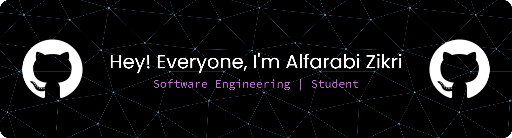

<h1 align="center">Hi there, What's Up 👋</h1>

<p align="center">
  
</p>



<p align="center">
  💻 Software Engineering Student at <strong>Politeknik Negeri Lhokseumawe</strong> <br>
  🌱 Currently learning <strong>React.js</strong> and <strong>Next.js</strong> <br>
  🔭 Interested in <strong>C, C++, C#</strong> and modern Frontend technologies <br>
</p>

---

## 📫 Connect with Me
<p align="left">
  <a href="https://www.instagram.com/a.pattnma/" target="_blank">
    
  </a>
  <a href="https://linkedin.com/in/username" target="_blank">
    
  </a>
  <a href="mailto:emailkamu@gmail.com" target="_blank">
    
  </a>
</p>

---

## 🚀 About Me
- 🌟 Passionate about technology and problem solving  
- 🎓 Currently studying **Software Engineering** at Politeknik Negeri Lhokseumawe  
- 💡 Skilled in **C, C++, HTML, CSS, PHP**  
- 🚀 Currently learning **React.js** & **Next.js**  
- 🧠 Sometimes I talk to my code... and it works  

---

## 🛠️ Technologies & Tools
<p align="left">
  
  
  
  
  
  
  
  
  
  
</p>

---

## ✨ Fun Section
<p align="center">
  
</p>


---

⭐️ From [Alfarabi Zikri](https://github.com/alfbizikri)


```diff
+ I love learning something new every day!
- I hate bugs that disappear when I try to show them to someone else 😤


